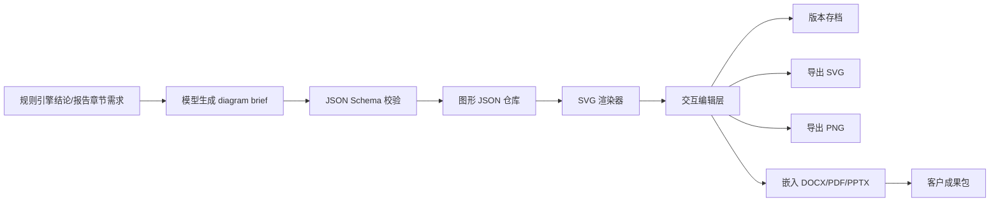

# Tunel 项目最终优化方案与远期设计方案

## 执行摘要

基于你已明确提供的现状，Tunel 当前最应该做的不是直接冲向“自动审图”，而是把一期 MVP 升级成**客户级成果生产系统**：界面上让客户觉得它是成熟的交付平台，报告上让客户拿到的是可直接汇报、可直接审阅、可直接复核的专业成品，示意图上让输出物是**专业、可控、可编辑、可导出**的图形成果，而不是“看起来很像但不能落地”的假工程图。中国当前监管口径仍把施工图审查定义为法定审查活动，同时近年的改革方向是“数字化图纸全过程管理”“BIM 报建和智能辅助审查”“全生命周期数字化管理”；这意味着 Tunel 的二期定位应是**辅助审查与成果生产**，而不是替代审查机构的自动审批系统。citeturn6search4turn7search2turn7search4

从国际成熟路径看，Tunel 的远期底座不应是“让大模型直接读一切图纸”，而应是**IFC/IDS/BCF + 空间图谱 + 规则引擎 + LLM 解释层**。这是因为 IFC 本身是 machine-interpretable 的开放标准，urlIFC 4.3 官方说明turn14search4 显示最新官方版本已是 4.3.2.0，而 urlbuildingSMART 的 IFC 4.3 正式发布说明turn14search0 说明 IFC 4.3 已于 2024 年正式成为 ISO 标准，并明确扩展到基础设施；urlIDS v1.0 官方说明turn0search5 已将信息交付要求标准化为可计算规则，urlBCF 官方说明turn11search1 则提供了适合问题闭环与跨软件协同的 issue 交换机制。与此同时，urlIFC 4.3 基础设施实施与验证报告新闻turn14search8 明确提到其基础设施与铁路协同工作中涵盖了 tunnel/common schema，这对 Tunel 的远期方向高度相关。citeturn14search4turn14search0turn0search5turn11search1turn14search8

因此，最终建议可以压缩成四句话。第一，**Tunel 1.5** 在未来 3 个月内聚焦“客户视图/实施视图分离、交付看板、可编辑报告工作台、结构化示意图系统、三类报告模板、质量检查器”。第二，报告引擎必须从“一次性长文本生成”升级成“事实锁定—检索摘要—角色化专家研判—正文生成—质量检查—多格式导出”的流水线，并强制使用结构化 JSON Schema。第三，示意图必须从“元数据挂件”升级成“图形 JSON → SVG 渲染 → 交互编辑 → Word/PDF/PPT 嵌入”的可控系统。第四，二期必须坚持 **IFC first、DWG second、RVT connector on demand** 的路线，而不是一开始把 DWG/CAD 当作唯一主数据源。citeturn3search0turn3search1turn3search2turn2search7turn2search13turn4search6turn4search1turn4search7

预算、团队规模、部署环境均**未指定**。下文的工时、资源与里程碑按“已有 MVP、继续沿用现有 Web 架构、优先本地或专有云可部署”这一前提给出区间估算。

## 设计原则与外部基线

Tunel 的短中期设计，建议先对齐两条现实边界。第一条是中国监管边界：url住建部《房屋建筑和市政基础设施工程施工图设计文件审查管理办法》turn6search4 仍将施工图审查定义为法定审查事项，由审查机构对强制性标准、安全性等进行审查；而 url住建部《工程建设项目全生命周期数字化管理改革试点工作的通知》turn7search2 又把“推进工程建设项目图纸全过程数字化管理”“推进 BIM 报建和智能辅助审查”列入试点内容。这意味着 Tunel 二期最稳妥的产品定位应是：**辅助研判、辅助审查、辅助汇报、辅助协同**。它可以大幅提高速度和一致性，但不应在产品表述上越过“最终法定审查”的红线。citeturn6search4turn7search2

第二条是国际 openBIM 边界：urlbuildingSMART IFC 介绍turn14search4 明确 IFC 的价值在于 machine interpretability 与 workflow automation；urlbuildingSMART IDSturn0search5 明确 IDS 用于定义信息交付要求并进行自动合规校验；但 urlbuildingSMART 对 IDS 能力边界的说明turn0search6 也明确提到 IDS 目前**不能定义几何细节**。这条界限非常重要，因为它直接决定 Tunel 二期不能把“信息完整性检查”和“几何/路径/净宽/净高/碰撞/疏散”混成一个模型任务，而应该拆成：**信息规则层**与**空间规则层**。citeturn14search4turn0search5turn0search6

国际案例方面，最值得参考的是新加坡的监管数字化路线。url新加坡 BCA 的 BIM 页面turn16search3 明确说明通过 urlCORENET X 官方帮助中心turn16search12 逐步把单一、协调好的 3D BIM 模型纳入监管审批；urlURA 的 CORENET X 提交流程说明turn16search5 显示 IFC+SG 等标准化格式已进入明确的提交流程要求；同时，urlSolibri 与 AcePLP 在新加坡的 Accessibility Compliance Checker Beta 说明turn12search0 显示，面向可访问性条款的规则校验正在试图进入监管工作流。这个案例的启发不是“Tunel 明天也去做 e-permit”，而是：**监管级数字化需要分阶段推进、需要明确数据标准、需要先从 machine-readable 的信息要求和规则集做起**。不过该无障碍检查器公开信息仍处 Beta 阶段，其正式接入范围、收费模式与大规模生产表现**需核验**。citeturn16search3turn16search12turn16search5turn12search0turn12search12

再向前看一步，文献综述也支持这种“分阶段、分层”的路线。2026 年《Automation in Construction》的系统综述指出 ACC 的未来重点仍集中在 interoperability、rule scalability 和 lifecycle re-checking；2025 年系统综述则认为“覆盖广泛法规的高度自动化综合检查系统”仍然是较远目标。Tunel 因而不应承诺一个“万能 AI 审图”，而应构建一个**逐层可验收、逐层可解释、逐层可扩展**的工程化体系。citeturn15search4turn15search5

## 界面与交付工作台方案

### 客户视图与实施视图

Tunel 现阶段最需要的不是更多菜单，而是更强的**角色分层**。建议把工作台拆成两个模式：**客户视图**和**实施视图**。

客户视图只显示交付相关内容：项目一句话结论、联通等级、推荐方案、关键风险、报告预览、示意图预览、成果导出、待客户补资清单。实施视图则保留评分因子、证据命中、规则结果、版本日志、模型运行状态、导出历史、问题闭环。这样做的核心原因，不是“隐藏技术能力”，而是把产品前台从“后台工具感”切换成“咨询成果感”。这一思路与 urlSolibri Premiumturn8search2 所强调的“中央治理的验证框架”“跨团队一致性的 validation standard”一致；urlSolibri Checking 说明turn8search1 也说明成熟检查平台会把 checking 结果、严重度与布局独立呈现，而不是把所有技术细节平铺给所有用户。citeturn8search2turn8search1

客户视图首页建议改为**交付看板**，而不是传统 dashboard。首页只保留六块：

| 模块 | 建议显示 | 验收口径 |
|---|---|---|
| 核心结论 | “建议按尽连地块控制，优先采用地下主通道” | 一屏可读、可复制到汇报材料 |
| 成果完整度 | 报告正文、附录、示意图、导出包状态 | 明确已完成/待复核/待补资 |
| 关键风险 | 接口标高、消防分区、运营边界、权属界面等 | 风险项可点击展开证据 |
| 项目就绪度 | 资料齐备率、缺项数量、待确认数量 | 缺项必须可追溯到字段 |
| 方案价值 | 客流组织、全天候通达、商业引流、实施可行性 | 用客户语言表达，不暴露底层算分细节 |
| 导出中心 | Word、PDF、PPT、SVG/PNG 图包 | 一键导出，显示版本号和时间戳 |

这个设计的关键并不是“更漂亮”，而是让客户第一眼看到的是**能不能交付**，而不是**怎么打分**。

### 报告工作台交互细节

报告页建议做成三栏。左侧是报告大纲和章节状态，中间是正文与图文预览，右侧是证据、模型建议、质量检查和版本差异。每个章节应支持六个即时操作：**重写本节、缩写本节、展开本节、改成领导汇报口吻、加强工程风险、插入相应示意图**。如果模型接口支持结构化流式输出，那么章节级刷新与字段级刷新都可以边生成边上屏；urlStructured Outputs 官方文档turn3search0 和其 streaming 说明表明，结构化字段可以按流逐步处理，这很适合把“执行摘要”“风险项”“图示 brief”等先展示出来，而不是让用户等待整篇报告一次性完成。citeturn3search0turn3search1turn3search2

建议报告工作台默认提供三种“写作视角切换”：

- **客户正式版**：正式、稳健、可审阅。
- **专家附录版**：证据全、规则全、参数全。
- **领导汇报版**：一页一结论，一页一图，一页一风险。

模板切换不应重新跑整套规则，而应复用 immutable facts，仅重做 summary、段落密度、图示组合与导出布局。

### 前端呈现路线对比

下表给出 Tunel 示意图与编辑器层的前端实现路线建议。考虑到 Tunel 的图种有限、成果需嵌入报告、需要可导出且可版本化，**1.5 版本应优先选原生 React + SVG，而不是先上重型画布/节点编辑器**。

| 路线 | 优点 | 局限 | Tunel 结论 |
|---|---|---|---|
| 原生 React + urlSVG 2turn2search13 | SVG 是 XML 文本格式，适合 DOM/CSS/JavaScript；MDN 说明它可搜索、可索引、可脚本化，且可无损缩放，非常适合标准化图种和报告嵌入。citeturn2search7turn2search13 | 编辑器交互层需自行封装 | **1.5 首选** |
| urlReact Flowturn18search9 | 官方定位是 node-based UI/diagram library，节点、边、视口、控制器齐全，适合流程编辑与关系图。citeturn18search5turn18search9 | 更像流程图编辑器，不像专业示意图版式引擎 | 适合做流程/依赖图，不做主图层 |
| urlJointJSturn17search0 | 官方文档强调 SVG-based diagramming，并提供 palette、toolbar、viewer、undo/redo 等成熟能力。citeturn17search0turn17search8 | 商业化/集成复杂度较高 | 若 2.0 需要重编辑器再评估 |
| urlKonvaturn17search1 / Canvas | Konva 基于 Canvas，优于高频拖拽、动画、海量形状与序列化导出。citeturn17search1turn22search0 | MDN 明确指出 canvas 本质上是 bitmap，对语义与无障碍暴露较弱，不适合作为正式成果主图层。citeturn22search3 | 只适合标注层、自由笔层或截图层 |

## 报告生成引擎方案

### 分阶段流水线

Tunel 报告生成必须从“单次 prompt + 长篇输出”升级为**六阶段流水线**。这是让模型真正体现“智能、全面、专业”的关键。

第一阶段是**事实锁定**。规则引擎输出的分数、等级、推荐方案、资料缺项、触发规则、证据来源全部进入 immutable facts，模型没有权限改写。第二阶段是**检索与证据压缩**，把知识库、规则库、案例库、客流表、接口条件等整理成结构化 evidence bundle。第三阶段是**角色化专家研判**，用多个 expert persona 先行输出短结论。第四阶段才是**客户版正文生成**。第五阶段是**质量检查器**，专查一致性、依据覆盖、幻觉和规范误引。第六阶段是**多格式排版与导出**。这种“先结构、后文笔”的方式与 urlStructured Outputs 官方文档turn3search0 所强调的 schema-first 方式一致，而 urlOpenAI Evals 官方指南turn3search5 与 urlEvaluation best practicesturn3search6 也明确把 eval 视为生产环境中保证可靠性的核心环节。citeturn3search0turn3search2turn3search5turn3search6

建议内置六个专家角色：

| 角色 | 主要输入 | 主要输出 | 是否进客户正文 |
|---|---|---|---|
| TOD/站城融合专家 | 功能属性、区位属性、站点级别 | 联通必要性与站城价值判断 | 是 |
| 轨道运营专家 | 客流、出入口、运营边界、非付费区 | 运营组织与客流风险 | 是 |
| 建筑/地下空间专家 | 标高、界面、动线、地下条件 | 方案比选与节点思路 | 是 |
| 消防/无障碍专家 | 疏散、防火分区、净宽净高、无障碍路径 | 风险与复核清单 | 是 |
| 实施策划专家 | 权属、时序、施工界面、投资边界 | 分期与实施建议 | 是 |
| 总编/QA 专家 | 全量事实与前述各角色输出 | 统一口径、删幻觉、提炼标题 | 是 |

建议每个专家先输出 300–600 字的结构化 brief，不直接写正文。正文阶段再统一合成。这样既能放大模型能力，又能控制稳定性。

### 结构化输入与输出

Tunel 1.5 报告服务建议统一采用 JSON Schema 驱动。下面这个输入结构足以覆盖客户版、专家版和汇报版三类报告。之所以建议这样做，是因为结构化输出在格式稳定性、一致性检查和前端可视化上都远优于自由文本输出。citeturn3search0turn3search2

```json
{
  "project": {
    "project_id": "tunel-2026-001",
    "project_name": "示例项目",
    "station_name": "示例站",
    "parcel_name": "示例地块"
  },
  "immutable_facts": {
    "score_percent": 62.03,
    "level": "尽连",
    "recommendation": "地下主通道",
    "missing_fields": ["接口标高", "消防分区", "产权界面"]
  },
  "evidence_bundle": [
    {
      "evidence_id": "E-001",
      "type": "rule",
      "title": "地下通道优先规则",
      "summary": "……"
    },
    {
      "evidence_id": "E-002",
      "type": "knowledge",
      "title": "客流与公共服务属性说明",
      "summary": "……"
    }
  ],
  "report_mode": "client_formal",
  "style": {
    "tone": "专业稳健",
    "must_include": ["方案比选", "工程风险", "实施建议", "资料补齐"],
    "forbidden": ["改写分数", "编造规范编号", "模糊结论"]
  }
}
```

对应输出结构建议如下。这样可以让前端逐节渲染，也便于在 QA 阶段做字段级校验与章节级重写。citeturn3search0turn3search1turn3search5

```json
{
  "executive_summary": "……",
  "sections": [
    {
      "section_id": "necessity_assessment",
      "title": "联通必要性评估",
      "body_markdown": "……",
      "evidence_ids": ["E-001", "E-002"],
      "risk_items": ["需复核接口标高"],
      "diagram_briefs": ["D-001"]
    }
  ],
  "quality": {
    "schema_valid": true,
    "facts_consistent": true,
    "evidence_coverage": 0.92,
    "hallucination_risk": "low"
  }
}
```

### 三类报告模板

Tunel 应默认输出三类成品，而不是只有一个 Markdown/Word 导出。

| 模板 | 面向对象 | 建议篇幅 | 结构重点 | 导出方式 |
|---|---|---|---|---|
| 客户正式版 | 甲方、审查会、外部顾问 | 20–40 页 | 结论、依据、比选、风险、实施建议、图文穿插 | DOCX / PDF |
| 专家附录版 | 内部设计、复核、实施团队 | 20–60 页 | 评分矩阵、规则命中、证据列表、缺项清单、版本日志 | DOCX / PDF / JSON |
| 领导汇报版 | 管理层、决策会 | 8–12 页 | 一页一结论、一页一图、一页一风险、一页一行动 | PPTX / PDF |

在导出栈上，建议采用“双轨制”。面向 Word 交付，优先使用 urldocxtplturn4search6 这一类 docx 模板引擎，因为它允许用现成 Word 模板做复杂图文版式；面向 PDF，若产品长期以 Python 为主，可选 urlWeasyPrintturn4search1 直接把 HTML/CSS/SVG 转为高质量 PDF；若前端样式和浏览器渲染更复杂，则可选 urlPuppeteer 的 PDF 能力turn20search8，因为其 `page.pdf()` 直接基于浏览器 print CSS，且支持切换 screen/print media；面向领导汇报版，urlPptxGenJSturn4search7 可在 Node/浏览器环境下直接生成兼容 PowerPoint/Keynote/Google Slides 的 OOXML 文件。citeturn4search6turn4search1turn20search8turn4search7

### 质量检查器

Tunel 1.5 必须把“报告质量”产品化，否则报告体验会高度随机。建议质量检查器至少具备下表所列规则：

| 检查项 | 判定逻辑 | 建议验收阈值 |
|---|---|---|
| Schema 校验 | 输出必须 100% 通过 JSON Schema | 100% |
| 规则一致性 | 分数、等级、推荐方案与规则引擎一致 | 100% |
| 依据覆盖 | 每个关键结论至少关联 1 条 evidence_id | ≥ 95% |
| 缺项诚实性 | 缺项字段不能被模型“补写成已知事实” | 100% |
| 幻觉控制 | 规范号、参数阈值、项目事实不得凭空生成 | 严重错误 = 0 |
| 风格适配 | 客户版、专家版、汇报版长度与语气符合模板 | ≥ 90% |
| 导出稳定性 | DOCX/PDF/PPTX 三端导出成功 | ≥ 95% |

其中最关键的是前 4 项。没有规则一致性和缺项诚实性，再漂亮的报告都会很危险。生产环境中建议建立 gold dataset、红线 case、回归集和人工评分集，并按版本持续跑 eval；这与官方 eval best practices 所建议的“先定义行为标准，再持续评测和迭代”的方法一致。citeturn3search5turn3search6

## 示意图系统方案

### 为什么要走图形 JSON → SVG

Tunel 的示意图目标不是“生成一张漂亮的图”，而是“稳定、可解释、可追溯、可编辑、可导出、可嵌入报告的专业图”。从这个目标出发，**图形 JSON → SVG** 是最合适的主路径。W3C 和 MDN 都把 SVG 定义为 XML-based 的二维矢量图形标准，支持 DOM、CSS、JavaScript，且能无损缩放；MDN 还特别强调 SVG 文本文件可搜索、可索引、可脚本化。相比之下，Canvas 更适合高性能动画和位图式绘制，但 MDN 明确指出 canvas 本身是 bitmap，绘制对象对辅助技术不具备语义暴露，这对正式成果、文本本地化和后续编辑并不友好。citeturn2search13turn2search7turn22search0turn22search3

因此建议 Tunel 把示意图分成两层。**成果层**用 SVG 生成计划关系图、路径图、比选图、剖面示意图、实施时序图；**交互层**在需要自由标注、高频拖拽或手绘时，可以临时叠加 Canvas/Konva，但最后导出时仍以 SVG 成品为主。这样可以同时满足编辑效率和成果可控性。citeturn17search1turn2search7turn22search3

### 图种分类

建议 Tunel 1.5 先固定五类图种：

- **站点—地块关系图**：车站、出入口、道路、地块、周边配套、主客流方向。
- **推荐联通路径图**：推荐路径、备选路径、节点、层级、主要接口。
- **方案比选图**：地下主通道、地下次通道、风雨连廊、高架连廊并列比较。
- **节点剖面/轴测图**：站厅非付费区、垂直交通、地块地下室、连接空间。
- **实施时序图**：近期预留、中期建设、远期一体化与责任边界。

这五类图已经足够支撑一期的大部分客户沟通与方案汇报，不必一开始做“看起来像施工图”的复杂表达。

下面是建议的图形 JSON 结构。其核心思想是：**所有图形都是语义对象，不是直接画路径字符串**。

```json
{
  "diagram_id": "D-001",
  "diagram_type": "recommended_connection_path",
  "title": "推荐联通路径示意",
  "view_mode": "plan",
  "nodes": [
    {
      "id": "station",
      "label": "地铁站",
      "type": "station",
      "x": 120,
      "y": 180,
      "level": "B1"
    },
    {
      "id": "parcel",
      "label": "目标地块",
      "type": "parcel",
      "x": 420,
      "y": 180,
      "level": "B1"
    }
  ],
  "edges": [
    {
      "id": "path-1",
      "from": "station",
      "to": "parcel",
      "type": "underground_primary",
      "label": "推荐地下主通道"
    }
  ],
  "annotations": [
    {
      "id": "a-1",
      "text": "需复核接口标高与消防分区",
      "anchor_to": "path-1"
    }
  ],
  "legend": true,
  "export": {
    "svg": true,
    "png": true,
    "pptx": true
  }
}
```

### 前端渲染与导出流程

建议前端渲染与导出流程如下。它把“规则结论”“图示需求”“结构化 JSON”“SVG 渲染”“版本化导出”串成一个闭环，也方便后续接入报告系统。



这个流程之所以成立，是因为 SVG 天生适合 DOM 化渲染与导出，而 PDF/报告工具链已经有成熟支持：urlWeasyPrintturn4search1 可把 HTML/CSS/SVG 输出为 PDF，urlPuppeteer PDFturn20search8 可直接按浏览器 print CSS 输出，urlPptxGenJSturn4search7 则适合把图片、表格和说明组装成领导汇报版 PPT。citeturn2search7turn2search13turn4search1turn20search8turn4search7

### AI 意向图的使用规范

AI 图像在 Tunel 中可以使用，但**只能作为意向效果图**，不能伪装成工程图。建议对所有 AI 图像自动加上水印或页下注记：

> 本图为意向效果示意，不作为工程图纸、审图依据或施工依据。

AI 图像仅用于表现氛围、材质、空间体验和导向语言，例如“地下主通道的照明、导向、公共空间氛围”，而不用于表达净宽、净高、标高、消防分区、结构界面等工程信息。工程相关表达应全部回到 SVG 示意图、参数表与规则检查结果。

### 示意图在二期中的扩展

当二期开始处理 CAD/BIM 源文件时，示意图系统还能继续复用。urlODA Drawings SDKturn2search11 官方说明其可导出 SVG 与 Three.js，这使 DWG/DGN 到 Web 预览和矢量成果的转换更顺畅；urlODA BimRv SDKturn19search0 则可在不依赖原生 Revit 的前提下访问 RVT 数据并发布 2D/3D PDF；而 urlArcGIS Indoorsturn9search3 与其 network toolset 提供了生成 indoor pathways、floor transitions、route barriers 的成熟概念模型，这对“站—厅—通道—地块”的路径表达很有启发。citeturn2search11turn19search0turn9search2turn9search3turn9search4

## 二期技术路线与工具选型

### 总体架构

二期建议明确采用下面这条技术链，而不是让一个大模型直接吞图：

**文件解析层 → 语义标准化层 → 空间图谱层 → 规则引擎层 → LLM 解释层 → 问题闭环层 → 客户/实施工作台**

其中每一层都有不同职责：

- **文件解析层**：读 IFC/RVT/DWG/DXF/点云衍生数据。
- **语义标准化层**：做分类、属性名、单位、层级、GUID 映射。
- **空间图谱层**：把空间、构件、连接、边界、标高、路径、约束转为可计算 graph。
- **规则引擎层**：执行 completeness、geometry、logic、risk checks。
- **LLM 解释层**：只做解释、总结、归类、写报告、写审查意见。
- **问题闭环层**：输出 issue、viewpoint、责任、状态。
- **工作台层**：面向客户与实施人员呈现结果。

最关键的一条原则是：**模型负责解释，不负责代替规则求真**。

### 工具与方案对比

下表给出 Tunel 二期最值得关注的工具/底座。结论非常明确：**IFC/IDS/BCF 开源栈优先，RVT/DWG 专有连接器按需补充**。

| 能力面 | 首选/备选 | 官方能力摘要 | Tunel 建议 |
|---|---|---|---|
| IFC 解析与几何 | urlIfcOpenShellturn1search5 | 官方文档说明其是开源 IFC 库，提供 C++/Python API、geometry iterator、多核/缓存处理、geometry tree、validate 等能力。citeturn1search7turn1search0turn1search4turn10search2 | **二期首选开源底座** |
| IDS 校验与报告 | urlIfcTesterturn10search3 + urlbuildingSMART IDSturn0search5 | IDS v1.0 已是 final standard；IfcTester 可读取/编写 IDS、校验 IFC，并输出 HTML/JSON/BCF 报告。citeturn0search5turn10search3turn10search4 | **信息完整性检查首选** |
| .NET 生态 IFC | urlxBIM Toolkitturn0search13 | 官方文档说明其支持在 .NET 中读、建、看 IFC，并支持几何/拓扑与 IFC↔COBie 转换。citeturn0search13 | 若团队偏 .NET，可作备选 |
| RVT 无 Revit 直读 | urlODA BimRv SDKturn19search0 | 官方页说明其可在不依赖原生 Revit 的前提下访问 RVT 数据、关系、材质与几何，并发布 2D/3D PDF。citeturn19search0 | 仅在必须直吃 RVT 时引入 |
| DWG/DXF 解析 | urlODA Drawings SDKturn2search11 | 官方页说明其可访问 DWG/DGN 全部数据，并导出 PDF、SVG、Three.js 等。citeturn2search11 | 做 CAD 补充入口，不做主语义来源 |
| 原生插件/写回模型 | urlRevit APIturn2search0 | 官方开发指南与 API 文档说明可读取元素几何、Room/Space Geometry、边界关系等。citeturn2search0turn13search0turn13search3 | 仅在需深度集成 Revit 插件时采用 |
| 商业规则平台 | urlSolibriturn8search0 | 官方说明其核心是 rule-based checking、custom rules、中央化 ruleset governance，并已面向 infrastructure 场景扩展。citeturn8search0turn8search1turn8search2turn8search3 | 适合作为标杆，而非二期必买 |
| 路网/可达性分析 | urlArcGIS Network Analystturn2search10 + urlArcGIS Indoorsturn9search3 | 官方文档提供 route、service area、location-allocation 等 solver；Indoors 支持 indoor pathways、floor transitions、barriers。citeturn2search10turn9search2turn9search4turn9search8 | 适合“站点—地块—楼层—路径”分析 |
| 问题闭环 | urlBCFturn11search1 | BCF 是 openBIM issue 标准，支持 file-based exchange 或 web service，并围绕视角、元素 GUID、坐标和评论组织问题。citeturn11search1turn11search2turn11search3 | **二期 issue 包装标准** |
| 术语/属性标准化 | urlbSDDturn21search4 | buildingSMART 将其定义为共享定义、类和属性的一组互联字典；IfcOpenShell 文档也说明可用来检索标准化分类与属性。citeturn21search4turn21search11 | 中长期可作为属性规范化底座 |

### 为什么必须 IFC-first

Tunel 二期若直接主攻 DWG，会在工程语义上付出很高成本。DWG 很适合做几何访问、图层读取、转 SVG/Web 预览，这正是 urlODA Drawings SDKturn2search11 的长项；但 Tunel 真正需要的，是“空间对象—属性—关系—规则”的稳定表示，而这恰恰更接近 IFC/IDS 组合的优势。尤其是 IFC 4.3 已经正式覆盖基础设施语义，并且其实施与验证报告明确涉及 rail/tunnel/common schema，对 Tunel 的轨道—地块连接类场景具有天然相关性。citeturn2search11turn14search0turn14search4turn14search8

这并不意味着 Tunel 要拒绝 RVT 或 DWG，而是应当采用**分层接入**：

- 若上游能交付 IFC：直接走 IFC 解析与规则引擎。
- 若只有 RVT：先看是否通过导出 IFC 能满足；不满足时再引入 RVT connector。
- 若只有 DWG/DXF：优先用于图形预览、边界/标注抽取和辅助比对，不作为唯一语义源。
- 若需 indoor/outdoor 路径分析：把 BIM/CAD 抽取结果送入空间图谱或 GIS 路网层。

### 审查分级建议

二期建议不要做“大一统审图”，而要做分级审查：

| 级别 | 范围 | 典型规则 | 结果形式 |
|---|---|---|---|
| 信息级 | 完整性、命名、分类、属性 | 必填属性、对象类型、标准命名、交付缺项 | JSON / 表格 / 缺项说明 |
| 几何级 | 路径、净宽净高、碰撞、连通性 | 通道宽度、标高落差、楼层连接、可达性 | 问题清单 / 示意图标注 |
| 逻辑级 | 设计意图与业务逻辑 | 非付费区衔接、运营边界、分期实施顺序 | 风险说明 / 条件性建议 |
| 解释级 | 客户可理解的专业表达 | 结论、比选、实施建议、会审说明 | 报告 / PPT / 批注 |

这里的核心是，**信息级和几何级要尽量 deterministic，解释级才交给 LLM**。这既符合 openBIM 的做法，也符合近年 ACC 研究对“interoperability、rule scalability、re-checking”的强调。citeturn15search4turn15search5turn15search10

### 参考案例的可借鉴点

Tunel 可以从三类成熟实践吸收方法，但不必照搬：

- **监管数字化路线**：以新加坡 CORENET X 为代表，强调统一 submission package、协调 BIM 模型、标准格式与分阶段 rollout。Tunel 可借鉴其“格式先行、流程先行、标准先行”的推进方式。citeturn16search3turn16search10turn16search12
- **商业模型检查路线**：以 urlSolibriturn8search0 为代表，强调中央化 ruleset、structured checking、severity、cross-team governance。Tunel 可借鉴其规则中心与结果呈现方式，但没必要在 2.0 就完全复制其完整产品形态。citeturn8search1turn8search2turn8search3
- **开源 openBIM 路线**：以 urlIfcOpenShellturn1search5、urlIfcTesterturn10search3、urlBCFturn11search1 为代表，强调开放标准、可编排校验、可报告、可协同。Tunel 若要追求可控成本和可本地化，这一路线最适合作为二期主干。citeturn1search7turn10search3turn11search1turn11search2

## 实施计划、验收标准与任务清单

### 里程碑与资源估算

以下估算以“已有 MVP、预算未指定、团队规模未指定、部署环境未指定”为前提，按 **1 产品 / 1 设计兼前端 / 1 前端 / 1 后端 / 1 模型工程 / 0.5 QA / 0.25 运维** 的精干模式估算，总量为区间值。

| 时段 | 目标版本 | 核心交付 | 估算工作量 | 关键验收标准 |
|---|---|---|---|---|
| 短期 3 个月 | Tunel 1.5 | 客户视图/实施视图、交付看板、报告工作台、三类报告模板、质量检查器、图形 JSON→SVG 引擎、成果包导出 | 125–170 人日 | 规则一致性 100%；Schema 通过率 100%；三类报告导出成功率 ≥95%；示意图 SVG/PNG/PPT 嵌入跑通；20 个案例中“轻改即可交付”比例 ≥70% |
| 中期 6–12 个月 | Tunel 2.0 | IFC/IDS 接入、空间图谱 v1、BCF issue 包、RVT/DWG 补充 connector、路径/可达性分析、项目级版本管理 | 180–260 人日 | IFC 模型接入成功率 ≥90%；IDS 规则执行可追溯；空间图谱支持楼层与路径关系；issue 可导出为 BCF/JSON；典型检查项可重复复跑 |
| 长期 12–24 个月 | Tunel 3.0 | 多模型协同审查、BIM/CAD/GIS 联动、数字图纸闭环、差异审查、更多 discipline 规则、半自动审查意见书 | 300–500 人日 | 多来源模型可统一映射；差异审查可重现；客户版与审查辅助版双闭环；上线后形成规则版本治理机制 |

这套节奏与中国“全生命周期数字化管理”“数字化图纸全过程应用”“BIM 报建和智能辅助审查”的政策方向一致，也更符合近年 ACC 研究所指出的“先解决互操作、规则扩展与 re-checking，再追求更大自动化覆盖”的现实路径。citeturn7search2turn7search4turn15search4turn15search5

### 可执行交付物清单与验收标准

3 个月内，建议把可交付物明确成下面这 8 个包，而不是笼统地说“优化系统”。

| 交付物 | 内容 | 验收标准 |
|---|---|---|
| 客户视图 | 结论卡、交付状态、风险摘要、导出中心 | 一屏讲清楚“结论—风险—下一步” |
| 实施视图 | 规则、证据、缺项、版本、日志 | 所有结论可追溯到字段或规则 |
| 报告工作台 | 三栏编辑、章节重写、图文联动、版本比较 | 支持单章重写与局部导出 |
| 报告服务 | 三类模板、角色化专家、QA 检查器 | 三类报告稳定生成 |
| 示意图引擎 | 图形 JSON、SVG 渲染、人工微调、导出 | SVG/PNG/PPT 嵌入成功 |
| 导出服务 | DOCX、PDF、PPTX、JSON、图包 | 版本号、时间戳、模板名完整 |
| 评测看板 | gold set、回归集、错误分布、分版本对比 | 每次上线前必须过评测 |
| 二期 POC 包 | IFC 接入 demo、IDS demo、空间图谱 demo | 至少跑通一条端到端链路 |

### 实施风险与缓解措施

| 风险 | 典型表现 | 影响 | 缓解措施 |
|---|---|---|---|
| 资料缺项严重 | 客户给不出接口标高、产权边界、消防条件 | 报告“专业但不真实” | 强制缺项声明；报告中自动区分“已知事实/待复核/推定建议” |
| 模型幻觉 | 编造规范号、夸大结论、掩盖缺项 | 严重伤害可信度 | Immutable facts、Schema 输出、规则一致性检查、红线 case 回归 |
| 报告风格波动 | 同类项目文本风格差异大 | 客户感知不稳定 | 建立 few-shot 样例库与模板词典；总编 QA 层统一口径 |
| DWG/RVT 解析复杂 | 二期前期接入速度慢 | 路线被拖慢 | IFC first；RVT/DWG 只做按需 connector |
| 商用工具授权 | ODA / Solibri / ArcGIS 授权费用与部署条款不清 | 预算与实施受阻 | 先用开源主干；商用工具只做必要 PoC；授权条款单独采购核验 |
| 客户误把示意图当施工图 | 项目沟通越界 | 法务与交付风险 | 对所有意向图强制水印；示意图与工程图严格分栏 |
| 导出品质不稳定 | Word/PDF/PPT 嵌图错位 | 交付体验差 | 统一版芯；用模板回归测试；复杂版式优先 HTML→PDF/PPT 生成 |

### 面向开发团队的任务清单

#### 前端

- 实现客户视图/实施视图切换与权限配置。
- 重构首页为交付看板，加入成果完整度、资料就绪度、关键风险与导出中心。
- 实现三栏式报告工作台：大纲、正文、证据/QA。
- 支持章节级操作：重写、压缩、扩写、换语气、插图。
- 实现图形 JSON → SVG 渲染器、图层面板、属性编辑、对齐吸附与版本差异显示。
- 实现成果预览与一键导出入口。

#### 后端

- 建立 report orchestration service，拆分为事实锁定、检索摘要、角色化研判、正文生成、QA、导出六阶段。
- 建立 evidence bundle 与 immutable facts 存储结构。
- 建立模板服务，支持客户版/专家版/汇报版三模板路由。
- 建立 diagram service，负责 schema 校验、版本存档、导出任务排队。
- 建立 export service，统一管理 DOCX/PDF/PPTX/图包。
- 为二期预留 IFC/IDS/BCF 接口层。

#### 模型工程

- 定义报告输入/输出 JSON Schema。
- 设计多角色 prompt 体系与 few-shot 样例集。
- 建立报告质量检查器：规则一致性、依据覆盖、缺项诚实性、幻觉扫描。
- 建立评测集：gold reports、反例集、极短资料集、红线幻觉集。
- 建立图示 brief 生成器与图文联动策略。
- 二期 PoC：跑通 IfcOpenShell + IfcTester + 空间图谱 demo。

#### QA

- 设计 UAT 用例：客户视图、实施视图、三类报告、示意图、导出、性能。
- 建立版本回归基线：同一项目多次生成的一致性比对。
- 做导出回归：Word/PDF/PPT 图片位置、分页、表格、字体。
- 建立“严重错误清单”：改分、伪造规范、遗漏缺项、结论矛盾。
- 对二期 connector 做样本库测试：IFC、RVT、DWG 各选典型样本。

#### 产品

- 明确三类报告模板的完整目录、写作风格与客户汇报口径。
- 明确五类示意图图种、图例规范、配色规范、免责声明规范。
- 输出 MVP 1.5 的验收表、灰度发布策略与培训材料。
- 组织真实项目共创，沉淀高质量 few-shot 样例而不是继续依赖低质量豆包式文本。
- 定义二期边界，防止商务表述越过“辅助审查”的定位。

#### 运维

- 建立异步任务队列，用于报告生成、导出与图像渲染。
- 配置对象存储/文件存储，统一保存报告版本、图包、输入 JSON 与评测结果。
- 建立可观测性：链路追踪、模型调用日志、失败重试、导出错误归因。
- 对模型服务与导出服务做资源隔离，避免大报告拖垮主站。
- 若部署在本地或专有云，提前验证文档引擎、字体与浏览器渲染环境一致性。

### 最终建议

Tunel 的最优路径，不是“把所有远期愿望一起塞进当前版本”，而是先把一期打造成**让客户满意的专业成果平台**，再把二期做成**可解释、可追溯、可复跑的辅助审查平台**。具体地说，未来 3 个月应该把精力集中到客户视图、报告工作台、结构化生成、质量检查器和 SVG 示意图这五件事上；未来 6–12 个月再进入 IFC/IDS/空间图谱/BCF；12–24 个月才逐步扩展到 BIM/CAD/GIS 协同与更强的审查规则。这个顺序既符合中国当前制度与数字化改革路径，也符合国际 openBIM 与 ACC 的成熟经验。citeturn6search4turn7search2turn14search4turn0search5turn11search1turn15search4turn15search5